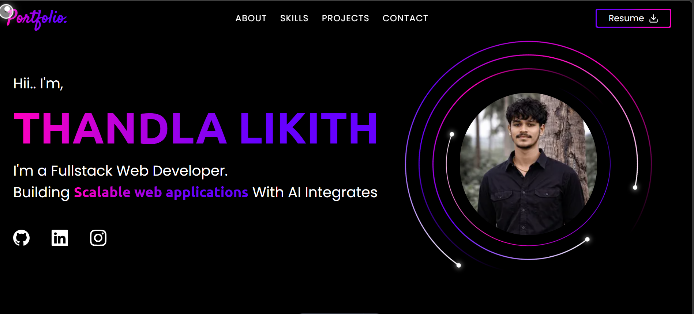

# Likhith | Full Stack Web Developer 

Welcome to my personal portfolio project.

This portfolio showcases my skills, projects, and ability to build real-world full stack applications.

---

## 📸 Preview



---

##  Live Demo

👉 (Add after deployment)  
https://your-vercel-link.vercel.app

---

## 🧠 About This Project

This is a modern developer portfolio built to demonstrate:

- Clean UI/UX design  
- Scalable frontend architecture  
- Backend integration  
- Real-world project implementation  

---

## 🛠 Tech Stack

- Astro  
- Preact  
- TypeScript  
- Tailwind CSS  
- GSAP (Animations)  

---

## 📄 Resume

[Download My Resume](public/LIKITH_RESUME.pdf)

---

## ⚙️ Run Locally

```bash
git clone https://github.com/LIKHITHH-HUB/likhith-portfolio.git
cd likhith-portfolio
npm install
npm run dev

📬 Contact
📧 Email: likhithrao2223@gmail.com
💼 LinkedIn: https://www.linkedin.com/in/thandla-likhith-in/
💻 GitHub: https://github.com/LIKHITHH-HUB

🌟 Key Features
Fully responsive design
Smooth animations
Modern UI
Optimized performance
Developer-focused structure

🌟 Key Features
Fully responsive design
Smooth animations
Modern UI
Optimized performance
Developer-focused structure

📌 Note

This project reflects my learning, consistency, and ability to build production-ready interfaces.